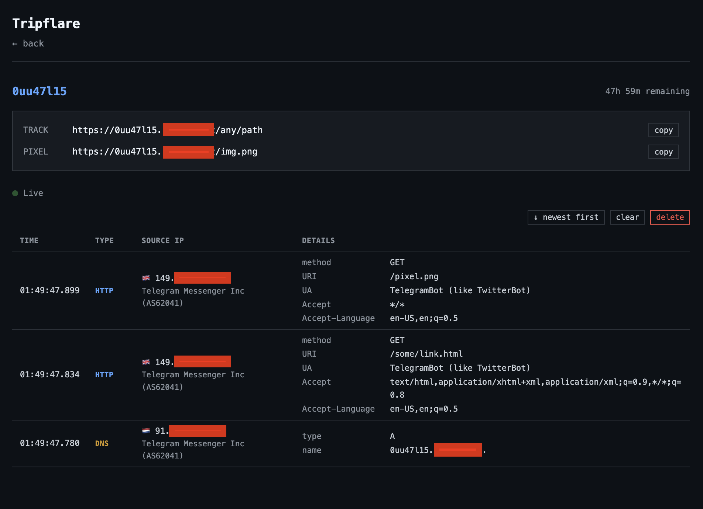
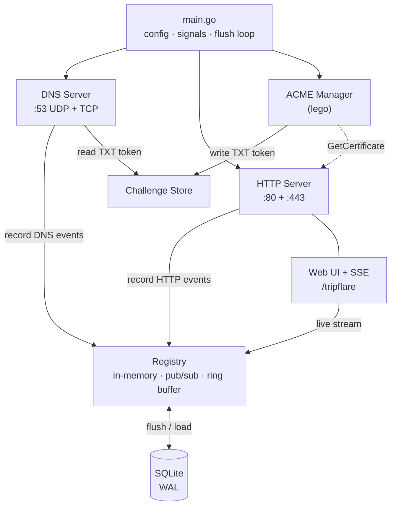
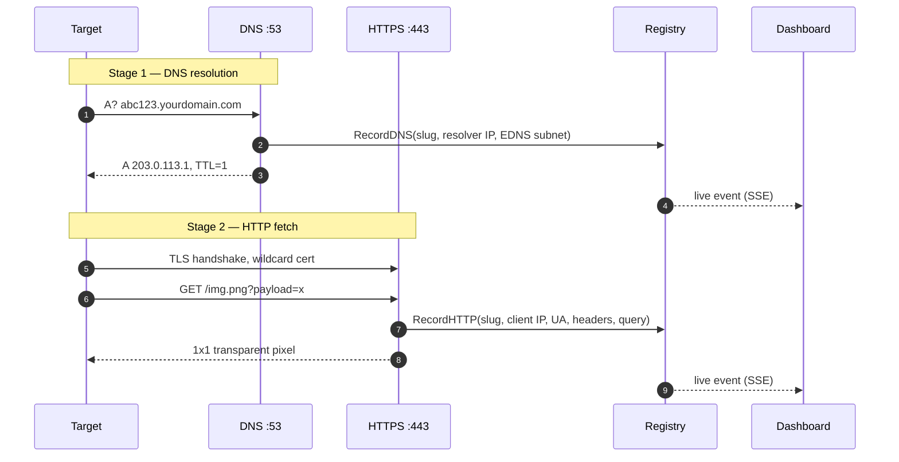

# Tripflare

[](https://github.com/pilat/tripflare/actions/workflows/ci.yml)

[](LICENSE)

**A self-hosted DNS + HTTPS canary in a single Go binary. Mint a unique link, drop it anywhere, and watch exactly who — and what — touches it, in real time.**

Tripflare is the authoritative DNS server *and* HTTPS server for your own domain. Every link it generates — `abc123.yourdomain.com` — is a tripwire. The moment anything resolves the name or fetches the URL, Tripflare records it (source IP, DNS resolver, EDNS client subnet, HTTP method, headers, User-Agent, path, and query payload) and streams it to a live dashboard.

> **Why own the DNS layer too?** A plain tracking pixel only fires when something makes the HTTP request. But the DNS lookup happens *first*, *separately*, and through *different infrastructure* — the target's resolver, not the target itself. Sandboxes, AV scanners, corporate proxies, and DNS-only exfil channels routinely resolve a hostname without ever fetching the URL. Tripflare logs **both stages**, so you see the resolver *and* the client — even when only one of them ever shows up.

---

## See it in action

Each event lands in the dashboard the instant it happens — geo-enriched, with full request detail.



*A Telegram link-preview bot caught unfurling a link. The two stages arrive from **different** Telegram IPs — the DNS query from `91.x.x.x`, the HTTP fetch from `149.x.x.x` — each tagged with its ASN and organization. That split is exactly what a DNS-blind tracking pixel can never show you.*

---

## How it works

A single binary runs three concurrent subsystems — a DNS server, an HTTP server, and an ACME manager — sharing one in-memory registry that's persisted to SQLite.



When a target touches a link, the reveal happens in two independent stages:



The two stages can come from different parties. The DNS query usually arrives from the target's resolver (an ISP or corporate DNS, sometimes far from the target); the HTTP fetch comes from the actual client. Seeing both is the whole point.

**A few deliberate details:**

- **`TTL=1` on every answer** so resolvers don't cache — repeat visits keep showing up.
- **Wildcard TLS** (`*.yourdomain.com`) via Let's Encrypt DNS-01, so links are clean HTTPS with no cert warnings. The same binary answers the ACME challenge over DNS.
- **Open Graph meta tags** on non-pixel responses, so pasting a link into a messenger triggers its preview bot to resolve and fetch — another capture.
- **Tracking pixels** (`.png` / `.gif` / `.jpg`) return a 1x1 transparent image, ideal for emails and documents.
- **Per `IP:slug` rate limiting** and a **ring buffer** per slug keep a noisy or hostile visitor from running away with memory.

For the full component breakdown, schema, and lifecycle, see [`ARCHITECTURE.md`](ARCHITECTURE.md).

<details>
<summary><strong>HTTP API</strong> (all routes on <code>:443</code>, Basic Auth required)</summary>

| Method | Path | Description |
|--------|------|-------------|
| `POST` | `/api/slugs` | Create a tracker (owned by the authenticated user) |
| `GET` | `/api/slugs` | List your trackers with event counts |
| `GET` | `/api/slugs/{slug}` | Tracker detail + full event history (GeoIP-enriched) |
| `DELETE` | `/api/slugs/{slug}` | Delete a tracker and its events |
| `GET` | `/api/slugs/{slug}/events` | Server-Sent Events stream — history replay, then live |
| `DELETE` | `/api/slugs/{slug}/events` | Clear a tracker's events |
| `GET` | `/tripflare` | Embedded web UI |

The whole thing is curl-friendly:

```bash
# create a tracker
curl -u admin:pass -X POST https://yourdomain.com/api/slugs

# watch events live
curl -u admin:pass -N https://yourdomain.com/api/slugs/abc123/events
```

</details>

---

## What you can do with it

Every use case maps to a signal Tripflare captures:

- **Out-of-band (OOB) interaction testing** — a personal, self-hosted alternative to Burp Collaborator / interactsh. Point blind SSRF, XXE, command injection, or SQLi callbacks at a unique slug and see the source resolve and connect.
- **Canary tokens** — embed a pixel or link in a sensitive document, repo, or share. If it's opened or leaked, you get the IP, resolver, and User-Agent.
- **Email open tracking** — drop the pixel into your own campaigns; it fires when the mail client loads images.
- **DNS-leak & egress testing** — verify whether a host, VPN, or network actually leaks DNS or reaches out over HTTP.
- **Catching link-preview bots** — paste a link into Telegram, Slack, or Discord and watch the unfurl bots resolve and fetch (Open Graph tags included).
- **CTF & security training** — OOB challenges and exfil channels without standing up infrastructure each time.

> Tripflare is for authorized testing, your own infrastructure, and consenting parties. It is **not** for unauthorized surveillance, phishing, or exfiltration. See [Responsible use](#responsible-use).

---

## Quick start

**You'll need:** a registered domain you can set NS records on, and a VPS with a static public IP and ports `53` (UDP+TCP), `80`, and `443` free.

```bash
git clone https://github.com/pilat/tripflare
cd tripflare
go build -o tripflare ./cmd/tripflare/

cp config.yaml.example config.yaml
# Edit: domain, external_ip, nameservers, auth
$EDITOR config.yaml

./tripflare -config config.yaml
```

Port 53 is privileged. Either run as root, or grant the binary the capability to bind privileged ports:

```bash
sudo setcap cap_net_bind_service=+ep ./tripflare
```

Then open `https://yourdomain.com/tripflare`, log in, and create your first tracker.

> **Running it as a real service?** The quick start runs Tripflare in the foreground. For a production install — a **prebuilt release binary**, a hardened **systemd** unit, freeing port 53 from `systemd-resolved` (the usual gotcha on Ubuntu/Debian), and optional GeoIP — see **[docs/deploy.md](docs/deploy.md)**.

---

## DNS delegation

This is the one piece of setup that isn't optional: Tripflare must be the **authoritative DNS server** for your domain, so the internet asks *it* to resolve your tracking links.

1. Get a VPS with a static public IP.
2. At your registrar, create A records for two nameserver hostnames (e.g. `ns1.example.com`, `ns2.example.com`) pointing to the VPS IP.
3. Set the domain's NS records to those nameserver hostnames.
4. Put `domain`, `external_ip`, and `nameservers` in `config.yaml`.

Verify the delegation before going further:

```bash
dig NS yourdomain.com                       # should list your nameservers
dig A test.yourdomain.com @your-vps-ip      # should return external_ip
```

---

## Authentication

All API and UI access requires HTTP Basic Auth. Generate a bcrypt hash and add it to the config:

```bash
htpasswd -nbBC 10 "" "your-password" | cut -d: -f2
```

```yaml
auth:
  - username: "admin"
    password_hash: "$2y$10$..."
```

Multiple users are supported, and each user only ever sees their own trackers.

---

## TLS / ACME

Tripflare manages its own wildcard certificate (`*.yourdomain.com` + the apex) via the Let's Encrypt **DNS-01** challenge — the built-in DNS server answers the challenge query itself, no external DNS provider needed.

1. Start with `acme.staging: true` and confirm a certificate is issued.
2. Switch to `acme.staging: false` for a trusted production certificate.
3. Certs live in `cert_path` and auto-renew when fewer than 30 days remain.

With `acme.enabled: false`, the server runs on a self-signed certificate (fine for local testing, browser warnings expected).

---

## GeoIP (optional)

Tripflare enriches every event with country, flag, ASN, and organization when MaxMind-format databases are present. Download [DB-IP Lite](https://db-ip.com/db/lite.php) (or MaxMind GeoLite2) and drop the files into `geoip_path`:

```
geoip/
  dbip-country-lite.mmdb
  dbip-asn-lite.mmdb
```

Files are matched by keyword (`*country*.mmdb`, `*asn*.mmdb`). Missing databases silently disable enrichment — everything else still works.

---

## Configuration reference

`config.yaml` is the source of truth; environment variables override individual fields.

| Field | Env override | Default | Description |
|-------|-------------|---------|-------------|
| `domain` | `TRIPFLARE_DOMAIN` | — | Your tracking domain (required) |
| `external_ip` | `TRIPFLARE_EXTERNAL_IP` | — | Server's public IP (required) |
| `nameservers` | — | — | NS hostnames returned for NS/SOA queries |
| `log_format` | — | `"json"` | `"text"` (human) or `"json"` |
| `sqlite_path` | `TRIPFLARE_SQLITE_PATH` | `"./tripflare.db"` | SQLite database path |
| `cert_path` | `TRIPFLARE_CERT_PATH` | `"./certs"` | TLS certificate storage |
| `acme.enabled` | `TRIPFLARE_ACME_ENABLED` | `false` | Enable ACME certificate management |
| `acme.email` | `TRIPFLARE_ACME_EMAIL` | — | ACME account email (required if enabled) |
| `acme.staging` | — | `true` | Use Let's Encrypt staging |
| `geoip_path` | `TRIPFLARE_GEOIP_PATH` | — | Directory with `.mmdb` files |
| `limits.slug_ttl` | — | `"12h"` | Slug expiration duration |
| `limits.max_events_per_slug` | — | `500` | Ring-buffer size per slug |
| `limits.flush_interval` | — | `"30s"` | Registry → SQLite flush interval |
| `limits.max_hits_per_slug_per_minute` | — | `60` | Rate limit per `IP:slug` |

---

## Built-in limits

This is research tooling, not infrastructure for doing harm. Tripflare ships with structural limits that make it unsuitable for persistent abuse and keep a €1/month VPS healthy:

- **Slug TTL** — all data auto-expires (default: 12 hours).
- **Rate limiting** — a per-`IP:slug` token bucket.
- **Event cap** — 500 events per slug; oldest evicted (ring buffer).
- **Authentication** — every access path requires valid credentials.
- **No bulk export** — events are viewed live, not harvested.

---

## Responsible use

Single-user security-research tooling, intended for authorized penetration testing, CTF competitions, and security education.

Use it to test **your own** infrastructure, in engagements where you have **explicit authorization**, or against parties who **consent**. It is not for unauthorized surveillance, phishing, data exfiltration, C2, or any activity without permission from everyone involved.

Anything that logs IP addresses carries responsibility. The single-user, self-hosted, short-retention design — slugs auto-expire, nothing is exported in bulk — keeps the data footprint minimal by default.

---

## License

[MIT](LICENSE)
